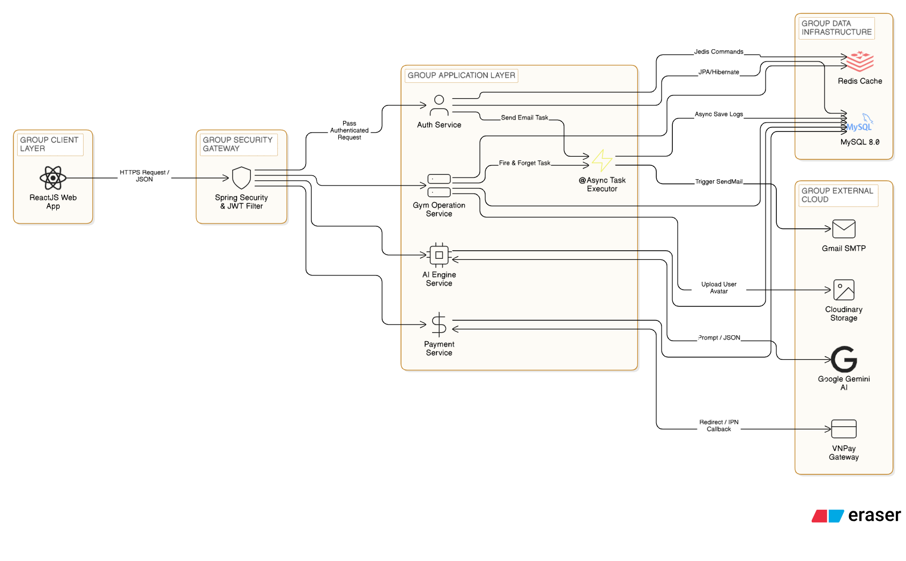
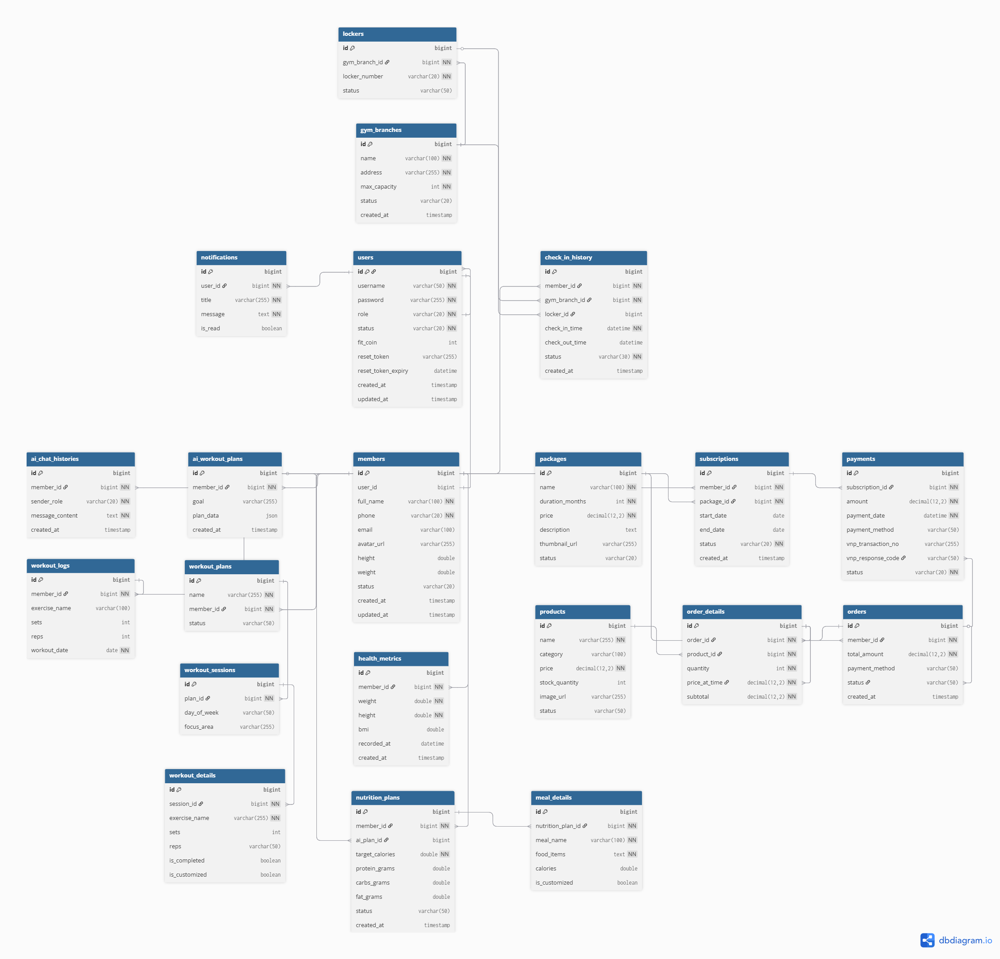

<h1 align="center">🏋️‍♂️ FITLIFE - Backend Service (Spring Boot)</h1>

<div align="center">
  
  
  
  
  
</div>

<p align="center">
  <strong>Comprehensive Digital Transformation Solution for Modern Fitness Centers</strong><br>
  👉 <em>Looking for the Client-side? Visit the <a href="https://github.com/lqhuy03/fitlife-frontend">FitLife Frontend Repository</a>.</em>
</p>

## 📑 Table of Contents
- [Executive Summary](#-executive-summary)
- [System Architecture](#-system-architecture)
- [Killer Features](#-killer-features)
- [Database Schema (ERD)](#-database-schema-erd)
- [Getting Started](#-getting-started)
- [API Documentation](#-api-documentation)
- [Contact & License](#-contact--license)

## 📖 Executive Summary
This is the core RESTful API service for the **FitLife Smart Gym Ecosystem**. It handles complex business logic including membership subscriptions, VNPay cashless transactions, IoT Smart Locker assignments, and Generative AI workout generation.

## 🏛 System Architecture


## ✨ Killer Features
- **Security & IAM:** JWT authentication, RBAC, Google OAuth2.0, and Email OTP recovery.
- **Generative AI Engine:** Integration with Google Gemini 2.5 API for personalized NASM-standard workout routines.
- **Payment Gateway:** VNPay Sandbox integration with 2-layer Hash Checksum verification.
- **High-Performance IoT Logic:** Redis caching for ultra-fast (<100ms) QR check-ins and Smart Locker allocation.
- **Automated CRM:** Spring `@Scheduled` CronJobs for sending subscription expiry reminders.

## 🗄️ Database Schema (ERD)
Strictly version-controlled using **Flyway**, comprising 18 normalized tables:


## 🚀 Getting Started

### Prerequisites
- JDK 17+ | Maven 3.8+ | MySQL 8.0+ | Redis Server (Port `6379`)

### Installation & Setup
1. **Clone the repository:**
   ```bash
   git clone [https://github.com/](https://github.com/)[your-username]/fitlife-backend.git
   cd fitlife-backend
    ```
   
2. **Configure Environment Variables (`application.yml`):**
   ```YAML
   spring.datasource.url: jdbc:mysql://localhost:3306/fitlife_db
   spring.datasource.username: root
   spring.datasource.password: your_password
   jwt.secret: YOUR_JWT_SECRET
   gemini.api-key: YOUR_GEMINI_KEY
   vnpay.tmn-code: YOUR_VNPAY_CODE
   vnpay.hash-secret: YOUR_VNPAY_SECRET
   ```
   
3. **Run the Application:**

```Bash
mvn spring-boot:run
```
## 📚 API Documentation
Interactive API documentation is generated via Swagger/OpenAPI 3.0.
Explore endpoints at: 👉 `http://localhost:8080/swagger-ui.html`

## 📞 Contact & License
**Author:** Le Quang Huy

**Email:** quanghuy.le.dev@gmail.com

**LinkedIn:** [linkedin.com/in/huy-le-java](https://www.linkedin.com/in/huy-le-java/)

License: Distributed under the MIT License.
